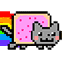

# Hi, geeks! 👋

I'm [L-Sun](https://github.com/L-Sun), a versatilist, like to 💻**code**, make 🛴**interesting toy**, build a 🎨**interactive website** and write some 📃**tech blogs**.

## 🧐 About

- 👩‍💻 A full stack developer.
- 📚 Graduated from Lanzhou University, studying for Computer Science master's degree at Shenzhen Universit. 
- ❤️ Love type soundness code, such as C++, TypeScript.
- 🤗 Embrace the spirit of open source.
- 🌱 Currently learning Computer Graphics, Distributed Storage.
- 🆙 With 1 years' development working experience.

<h2>
    
    My Favorite Tools, Language, Libraries.
</h2>

<figure>
    
    
    
    
    
    
    
    
    
    
    
    
    
</figure>

## Hello world!

<figure style="display: flex; justify-content: space-between; margin: 0;">
    
    
</figure>

 

    <cite>日々私たちが過ごしている日常は、実は奇跡の連続なのかもしれない。</cite>

    

